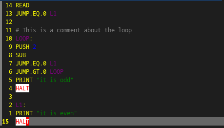

### JAN language



> [!NOTE]
> This is only a playground project for a new stack-based language JAN.

##### TODO
* [x] Interpreter
* [ ] Compiler
* [x] [TreeSitter](https://tree-sitter.github.io/tree-sitter/)
* [x] [LSP](https://microsoft.github.io/language-server-protocol/)

#### Styling

```lua
vim.cmd.highlight '@jan_halt guibg=white guifg=red'
vim.cmd.highlight '@jan_keyword guifg=yellow'
vim.cmd.highlight '@jan_comment guifg=gray'
vim.cmd.highlight '@jan_number guifg=blue'
vim.cmd.highlight '@jan_label guifg=purple'
vim.cmd.highlight '@jan_text guifg=green'
```

#### Registering LSP (Nvim example)

```lua
--[[
-- JAN Language 
--]]
local jan_lsp_client = vim.lsp.start_client {
  name = 'jan-lsp',
  cmd = { '/path/to/lsp_runner.lua' },
}

if not jan_lsp_client then
  vim.notify 'Something went wrong with JAN-LSP!'
end

vim.api.nvim_create_autocmd('FileType', {
  pattern = 'jan',
  callback = function()
    vim.lsp.buf_attach_client(0, jan_lsp_client)
  end,
})
```

#### Resources

* **["Making a Programming Language & Interpreter in under 10 minutes!"](https://www.youtube.com/watch?v=A3gTw1ZkeK0)**  
  by [bvdl.io](https://www.youtube.com/@bvdlio).

* **[Learn By Building: Language Server Protocol](https://youtu.be/YsdlcQoHqPY)**  
  by [TJ DeVries](https://www.youtube.com/@teej_dv)

