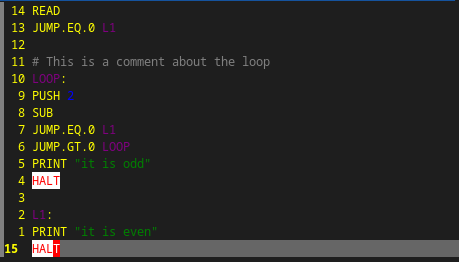

### JAN language

This is a playground project for a new language JAN. The language itself is a stack-based language based on the YT video
["Making a Programming Language & Interpreter in under 10 minutes!"](https://www.youtube.com/watch?v=A3gTw1ZkeK0) by
[bvdl.io](https://www.youtube.com/@bvdlio).

